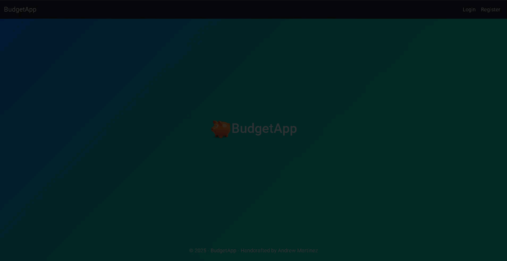
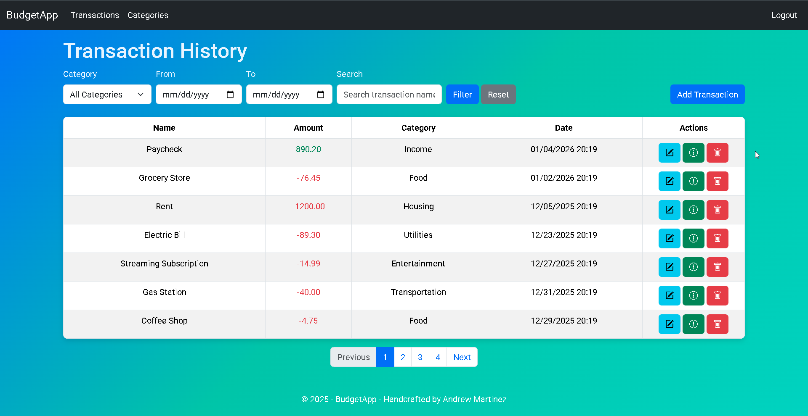

# Budget App

A full-featured personal finance management web application built with ASP.NET Core MVC. Budget App empowers users to
take control of their finances by providing an intuitive interface for recording all financial transactions,
categorizing spending patterns, and gaining insights into their money flow. Whether you're tracking daily expenses,
monitoring income sources, or analyzing spending habits, this app provides the tools you need to maintain financial
awareness and make informed decisions about your budget.



#### Manage Transactions:



#### Manage Categories:


## Features

- Authentication
- Create and manage transactions
- Track income and expenses
- Categorize transactions
- Pagination
- Search and filtering

## Getting Started

### Prerequisites

- .NET 10
- MSSQL Local Database

### Configuration

- Update connection strings and environment-specific settings in:
    - appsettings.json

### Running the App

1. **Clone the repository:**

   ```bash
   git clone https://github.com/andymartinez1/Budget-App.git
   ```

2. **Navigate to the project directory:**

   ```bash
   cd BudgetApp
   ```


3. **Restore dependencies:**

   ```bash
   dotnet restore
   ```

4. Update the database

    ```bash
    dotnet ef database update
   ```  

5. Build and run the app:
   ```bash
   dotnet build
   dotnet run
   ```

> [!IMPORTANT]
> You must be signed in to view and edit the transactions. You can register for an account or use the default user account created in Identity:
>
> Username: test@test.com
>
> Password: Password1!

## Tech Stack

- ASP.NET Core MVC
- Identity
- .NET 10
- MSSQL LocalDB 
